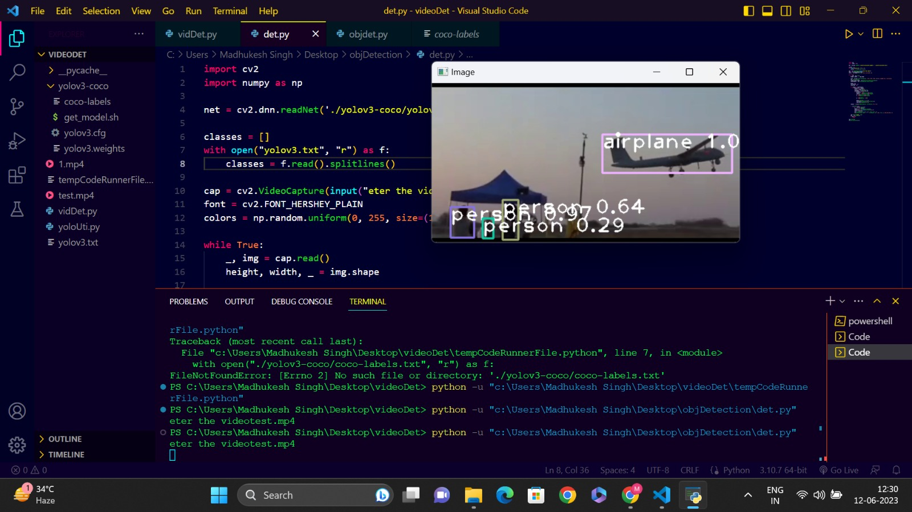

# VideoDetection
OpenCV `dnn` module supports running inference on pre-trained deep learning models from popular frameworks like Caffe, Torch and TensorFlow. 

When it comes to object detection, popular detection frameworks are
 * YOLO
 * SSD
 * Faster R-CNN
 
 Support for running YOLO/DarkNet has been added to OpenCV dnn module recently. 
 
 ## Dependencies
  * opencv
  * numpy
  
`pip install numpy opencv-python`

**Note: Compatability with Python 2.x is not officially tested.**

 ## YOLO (You Only Look Once)
 
 Download the pre-trained YOLO v3 weights file from this [link](https://pjreddie.com/media/files/yolov3.weights) and place it in the current directory or you can directly download to the current directory in terminal using
 
 `$ wget https://pjreddie.com/media/files/yolov3.weights`
  
 `$ python yolo_opencv.py --image dog.jpg --config yolov3.cfg --weights yolov3.weights --classes yolov3.txt`
 *now properly add the paths of files in the input.
  ### sample output :
 
 
